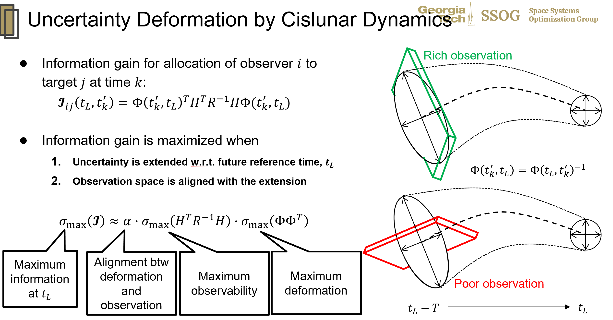



## **Predictive Sensor Tasking in Cislunar Space: A Research Overview**

Greetings to the academic and research community,

I am pleased to present a summary of our recent exploration into the domain of predictive sensor tasking for cislunar space situational awareness. As we venture further into the realms of space exploration and research, enhancing our predictive capabilities becomes ever more critical. Here, I provide a concise overview of our findings and methodologies.

### **Research Motivation**
In cislunar space, tracking remains a formidable challenge. Stable demands, such as catalog maintenance for recognized objects and pre-planned missions, are juxtaposed with potentially unexpected demands. Situations like an uncooperative spacecraft releasing a subsidiary or sudden detection of unanticipated translunar objects can create unforeseen tracking needs.

Given these scenarios, there arises a need to answer: How does the cislunar space situational awareness (SDA) system respond to such unexpected demands? What architecture would impart robustness to the SDA against these unpredicted challenges?

### **Proposed Methodology**
To address these questions, our study introduces a predictive sensor tasking algorithm designed for optimal efficiency while maintaining resilience against architectural changes in SDA. Key highlights include:
- **Efficient Formulation**: Our linear integer programming formulation facilitates multi-observer, multi-target sensor tasking, providing a deterministic, model-based, and near-optimal sensor tasking policy.
- **Measurement Paradigm**: We employ optical measurements of target angle and angular rate, providing a refined mathematical foundation for our modeling process.

### **Harnessing the Extended Information Filter**
A cornerstone of our methodology is the utilization of the Extended Information Filter (EIF). Unlike methodologies dependent on the extended Kalman filter, the EIF permitted a linear representation of future uncertainty as a function of sensor allocation variables. This approach ensures an anticipatory system, adept at forecasting and responding to potential future uncertainties.

### **Algorithmic Foundations**
Central to our approach is the observer-target allocation variable, with "1" denoting an observer tasked to a target at a specific time step, and "0" otherwise. Our research advanced two primary strategies:
1. Aim to maximize the total observed information system-wide.
2. Prioritize and maximize information related to the least known target within the system.

Our research provides robust proof for the assertion that optimal observer-target assignment should be oriented such that we observe the point where future state uncertainty is most extended, specifically from directions where the extended information is well observed. This approach capitalizes on astrodynamics to pinpoint areas of uncertainty, ensuring an optimal positioning to derive maximum informational value.

### **Validation and Comparative Analysis**
We subjected our formulations to rigorous testing, comparing against standard 'myopic' policies. The results were affirming: our anticipatory tasking significantly outperformed myopic policies, offering a comprehensive strategy for information gain, both system-wide and for the least known targets.

Our conclusions were further buttressed by extensive numerical analysis, underscoring the potential and efficacy of our proposed methodologies.

### **Conclusion and Forward Path**
By adeptly leveraging the Extended Information Filter, our research delineates a path to a superior sensor tasking algorithm for cislunar space. Furthermore, it illuminates the intricate dynamics of cislunar space and how they can be harnessed to optimize state uncertainty predictions.

For a deeper and more detailed exploration, I invite readers to peruse the full research paper. Queries and discussions on the topic are most welcome.

Thank you for your engagement with our research endeavors. 

---

*For those deeply invested in the subject, the complete research paper offers a comprehensive understanding of our methodologies and findings.*

  

#### Related publication:
- **K. Tomita**, Y. Shimane, and K. Ho, **"Multi-Spacecraft Predictive Sensor Tasking for Cislunar Space Situational Awareness,"** AMOS Conference, Maui, Hawaii, September 2023.